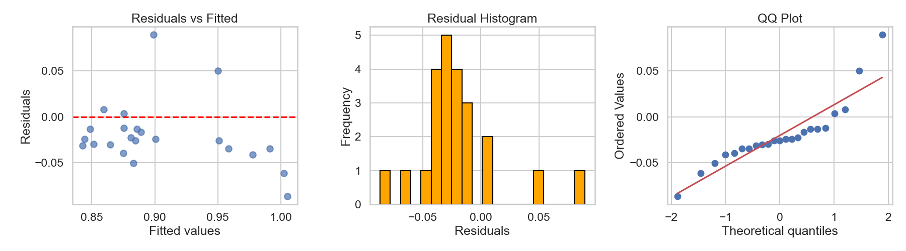
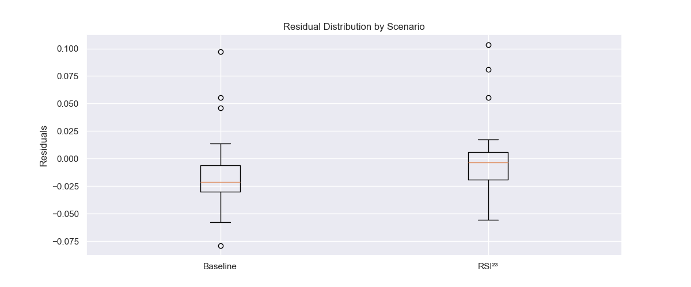
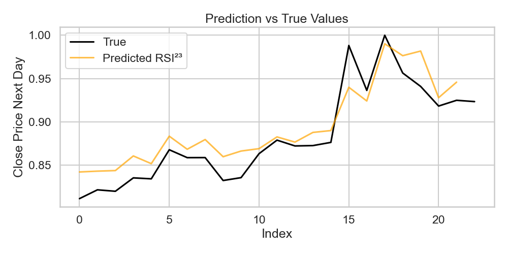

# Final Reporting

## Executive Summary
- Adding RSI²³ features slightly improves RMSE and MAE over baseline, but residual patterns indicate tail risks remain.
- Model performs well under normal daily volatility; predictions may be unreliable in extreme market events.
- Recommendations: Use model as a reference tool; monitor high-volatility periods.

## Charts and Interpretation

### 1. Baseline Residual Diagnostics

- Shows residuals vs fitted, histogram, and QQ plot for the baseline model.
- Insight: The residuals show a non-random pattern with clusters around specific values, indicating systematic prediction errors. The Q-Q plot deviation from the diagonal line confirms non-normal error distribution.
- The baseline model is not efficient in capturing important data patterns as evidenced by the non-random residual distribution and significant deviation from normality in errors.

### 2. RSI²³ Residual Diagnostics

- Diagnostic plots for the enhanced RSI²³ model including residual distribution, histogram, and Q-Q plot.
- Insight: The residuals demonstrate improved random scattering around zero with reduced clustering, indicating better pattern capture. While the distribution remains left-skewed, the Q-Q plot shows closer alignment to normality compared to the baseline.
- Limitation: The persistent non-normality in residuals suggests the model may still be missing some non-linear relationships or influential factors in the data.

### 3. RMSE Comparison with Bootstrap CI

- Shows RMSE for baseline vs RSI²³ with 95% CI from bootstrap.
- Insight: The observed lower average RMSE for RSI²³ is not statistically significant. The RSI²³ model has a wider confidence interval that completely encompasses the Baseline's interval. The performance of the RSI²³ model is less precisely estimated and more variable than the Baseline model.
- Limitation: The current evidence cannot confirm whether the RSI²³ model is genuinely superior, inferior, or equivalent to the Baseline model due to excessive performance variability.

### 4. Residual Distribution by Scenario

- Boxplot comparing baseline vs RSI²³ residuals.
- Insight: The RSI²³ model's residuals (errors) are clustered more tightly around zero, meaning its predictions are consistently more accurate than the Baseline model.
- Limitation: This shows the distribution of error but not the overall size of error (like RMSE).

### 5. Prediction vs True Values

- Line plot showing predicted vs true close prices (RSI²³ model).
- Insight: While the model captures the general trend of the true values, there are visible deviations and instances where predictions clearly diverge from actual outcomes, particularly around peak and trough values.
- Limitation: The visual misalignment suggests the model may be oversmoothing or missing important patterns, indicating potential underfitting or insufficient feature engineering to capture key market dynamics.

## Assumptions & Risks
- Linear relationship between features and next-day close.
- Features are properly measured, minimal missingness.
- Market conditions in training and test periods are representative.
- Risk: Extreme events and non-linear effects may cause large prediction errors.

## Sensitivity Summary
## Sensitivity Summary
| Scenario | RMSE   | MAE    | R²     | Δ RMSE vs Baseline |
|----------|--------|--------|--------|------------------|
| Baseline | 0.0390 | 0.0313 | 0.3570 | 0.0000           |
| RSI²³    | 0.0354 | 0.0238 | 0.4699 | -0.0036          |

- Adding RSI²³ reduces RMSE slightly.
- Sensitivity: Results could change if market volatility increases or extreme events occur.

## Decision Implications
- Model useful for reference and short-term trend indication.
- Should not be solely relied upon for trading decisions.
- Include monitoring for extreme volatility or out-of-distribution conditions.

